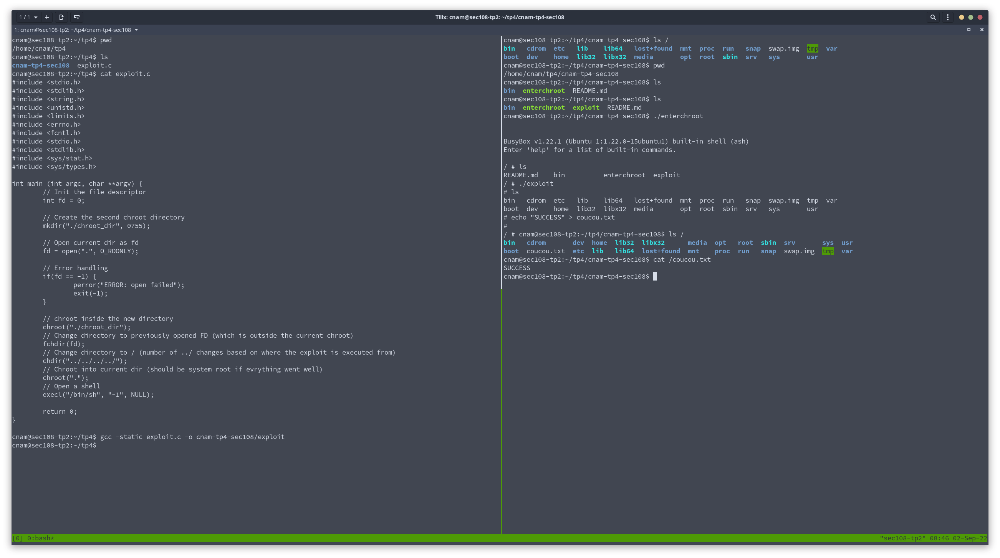

# TP4 - SEC108 - Écriture d'un exploit contre chroot

**Author :** Amaury JASPAR

* src : Fichiers sources en C de l'exploit
* bin : binaries
* ressources : captures d'écran utilisées dans le README

## Exploitation

L'exploit est basé sur une vulnérabilité noyau connue. On utilisera ici la techique du double chroot(). La technique consiste a rentrer dans le premier chroot, ouvrir un file descriptor dans le répertoir courant. Créer un nouveau dossier, chroot dans ce dossier (alors que nous sommes déjà dans le premier chroot). Une fois dans ce second chroot, on peut changer notre répertoire courant à l'aide de la fonction `fchdir` contrairement à `chdir`, prend un file descriptor en argument (celui que nous avons ouvert plus tôt). Ce changement nous fais sortir de l'arborescence du second chroot, et comme nous sommes rentré dans le second chroot, nous ne sommes plus bloqué dans le premier. On peut alors remonter l'arborescence système jusqu'à atteindre le `/`, chroot dans ce répertoire et ouvrir un shell, ce qui nous donne le contrôle du système.

## Démonstration

